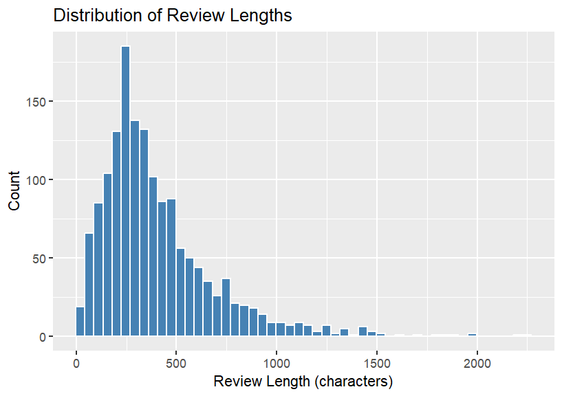
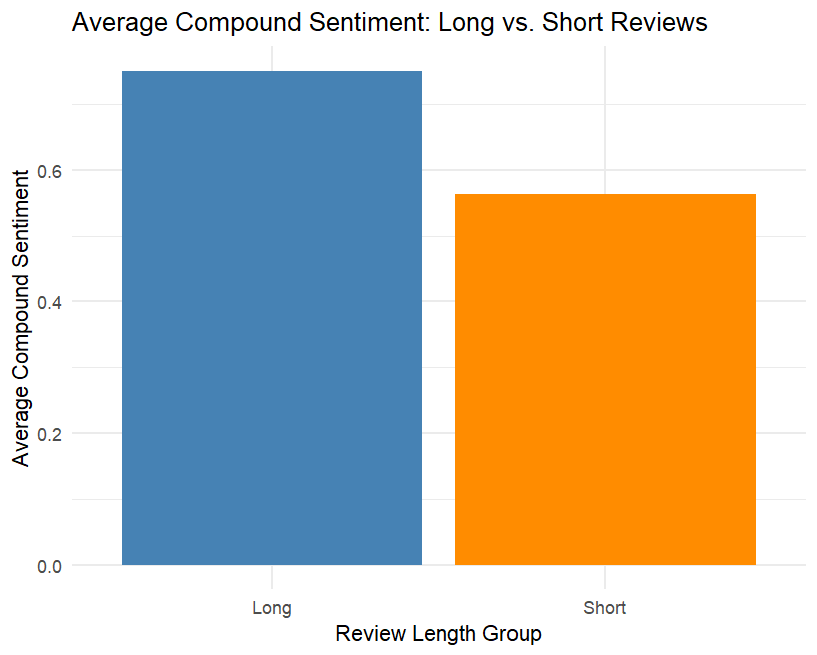
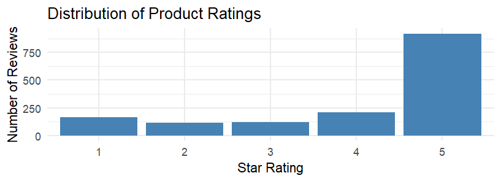
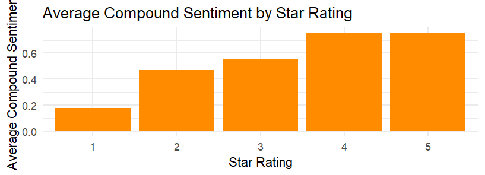
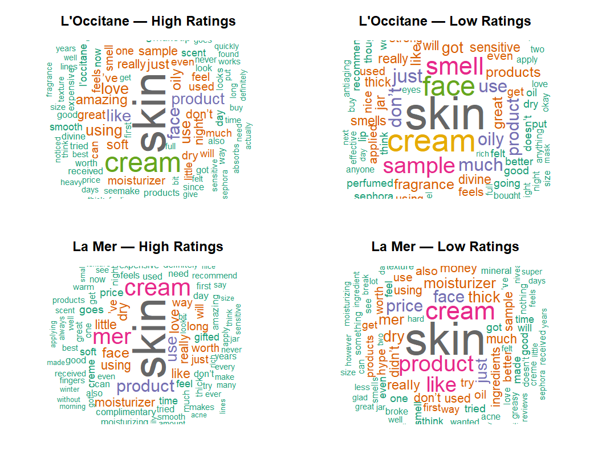
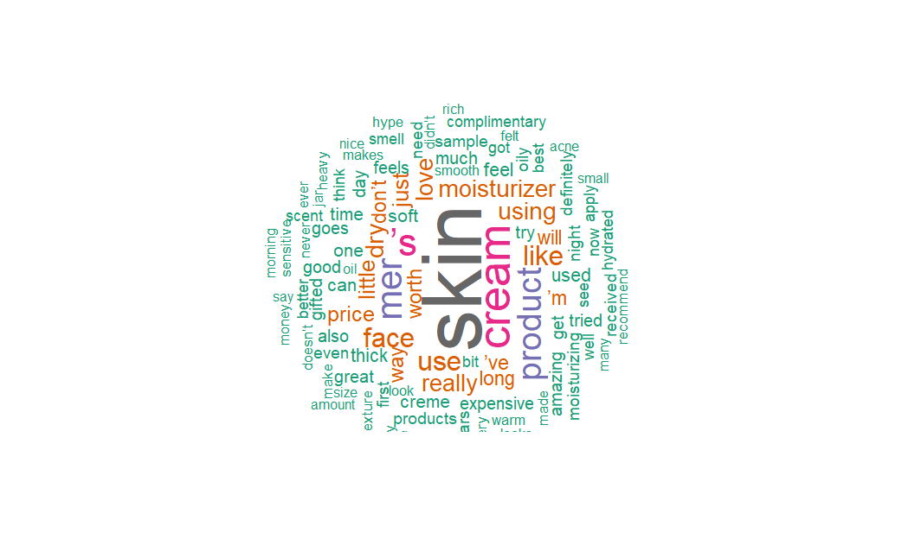

# Listening to Online Reviews: Consumer Sentiment & Brand Analytics

Decoding brand equity and customer loyalty in prestige skincare using NLP and sentiment analysis.

## Project Summary

This project looks at over 1,500 consumer reviews for two prestige skincare brands, L'Occitane and La Mer, to understand what actually drives customer satisfaction and loyalty. I used VADER sentiment analysis and NLP techniques in R to go beyond star ratings and find out why customers feel the way they do.

La Mer has a slightly higher average rating than L'Occitane (4.06 vs lower), but the two brands win in different ways. L'Occitane does well on what I'd call sensory storytelling: customers describe the product as part of a calming daily ritual. La Mer wins on perceived performance and indulgence. I also found that 1 star reviews tend to be noticeably longer than 5 star reviews, which suggests they're a useful source of detail for product improvement rather than just noise.

As a final step, I used these findings to sketch out a seasonal subscription box concept pairing Starbucks drinks with skincare, based on the STEPPS framework.

## Tools & Methods

| Category | Tools |
|---|---|
| Language | R |
| Sentiment Analysis | VADER |
| NLP / POS Tagging | udpipe |
| Text Mining | tm, wordcloud, tidytext |
| Visualization | ggplot2, gridExtra |
| Statistical Testing | Welch two sample t-tests |

## Key Findings

### 1. Review length reveals emotional nuance



The average review is about 404 characters. I split reviews into "Long" and "Short" using that as the cutoff, and a clear pattern showed up:

For 1 star reviews, the longer ones were actually less negative (compound score around 0.30) than the short ones (around 0.10). That difference held up in a Welch t-test (p = 0.029). For 5 star reviews, the pattern flips and gets stronger: long reviews were noticeably more positive (0.83) than short ones (0.69), and that difference was highly significant (p ≈ 3.1e-11).



In practice, this means long reviews carry more signal in both directions. They're worth mining separately for product feedback and for marketing material.

### 2. Ratings skew positive, and sentiment tracks with them closely




Sentiment rises steadily as star rating goes up, which is a nice sanity check on the data but also useful practically. Because the relationship is so consistent, a brand could watch sentiment drift over time as an early signal before it shows up in the average star rating.

### 3. L'Occitane vs La Mer

| Brand | Avg. Compound Sentiment | Positive to Negative Rating Ratio |
|---|---|---|
| L'Occitane | 0.619 | about 3 to 1 |
| La Mer | 0.660 | about 4 to 1 |

La Mer edges out L'Occitane on both sentiment and rating ratio, but both brands are clearly well liked. They just occupy different territory. L'Occitane feels approachable and gentle, good for everyday use. La Mer feels indulgent and higher performing, but at a price customers notice.



### 4. What customers actually say

Using part of speech tagging (udpipe), I pulled out the adjectives most associated with high and low rated reviews for each brand.

L'Occitane's high rated reviews use words like amazing, soft, great, smooth, worth. The low rated reviews mention oily, thick, dry, strong, sensitive, mostly about texture and skin fit rather than ineffectiveness. La Mer's complaints center more on heaviness, greasiness, and price, while its praise focuses on rich texture, hydration, and a visible glow.

So the two brands aren't really competing on the same axis. L'Occitane's issues are about fit for different skin types. La Mer's issues are more about whether the price is worth it.



## Strategic Application: Starbucks x Fast Beauty

As an extension of the analysis, I sketched out a seasonal subscription box idea that pairs Starbucks' seasonal drinks with matching skincare themes:

| Season | Drink Inspiration | Skincare Theme |
|---|---|---|
| Spring | Iced Matcha Latte | Fresh start, gentle detox, soft glow |
| Summer | Pink Drink | Bright, fruity, radiance focused |
| Fall | Pumpkin Spice Latte | Cozy, barrier repair, comfort |
| Winter | Peppermint Mocha | Indulgence, hydration, holiday sparkle |

This part is meant to show how sentiment analysis can feed directly into product and marketing ideas, not just diagnostics.

## Repository Structure

```
README.md
analysis/
  sentiment_analysis.R
data/
  authors.csv
  products.csv
  reviews.csv
figures/
  01_review_length_distribution.png
  02_rating_distribution.png
  03_avg_sentiment_by_rating.png
  04_sentiment_long_vs_short.png
  05_wordcloud_positive_reviews.png
  06_wordcloud_brand_comparison.png
```

## Reproducing the Analysis

```r
install.packages(c("tidyverse", "vader", "ggplot2", "gridExtra",
                    "tm", "wordcloud", "RColorBrewer", "tidytext", "udpipe"))
```

Run `analysis/sentiment_analysis.R` from the project root after placing the data files in `data/`. The udpipe English model downloads automatically the first time you run `udpipe_download_model()`.

## Author

Tawanda Matiashe
M.S. Business Analytics, Lehigh University
tawandamatiashe2@gmail.com
